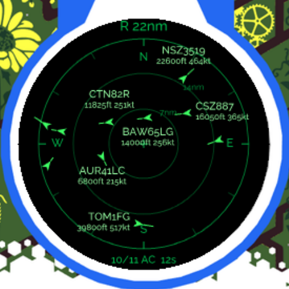
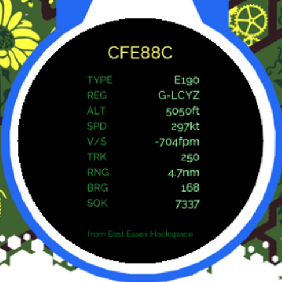
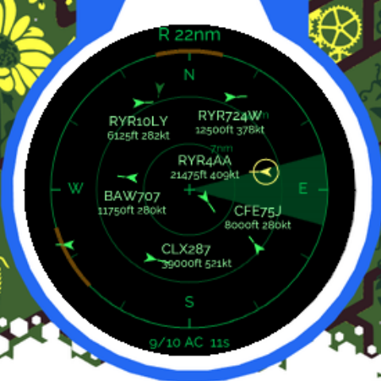

# SkyScope

A live ADS-B flight radar for the [EMF Tildagon / Spaceagon
badge](https://tildagon.badge.emfcamp.org/). Set your location and range, and
watch real aircraft move across a north-up radar scope on the badge's round
screen.

Contacts are plotted by bearing and distance from wherever you put the observer,
each with a heading vector and a decluttered label showing callsign, altitude and
speed. Data comes from free, keyless community ADS-B aggregators over the badge's
Wi-Fi.

Pure MicroPython — it runs on stock Tildagon OS, with no custom firmware.

| Radar scope | Aircraft detail | Touch ring |
|---|---|---|
|  |  |  |

*Real traffic over Essex, captured from the badge simulator. In the middle, a
Cargolux 747-8 at 39,000 ft on its way from Houston to Luxembourg. On the right,
the touch ring: a highlighted bearing with the nearest aircraft in it selected,
and two armed alert sectors pulsing amber on the outer ring.*

## Features

- **North-up radar scope** — three range rings, ticks every 30°, cardinal marks,
  aircraft glyphs rotated to their track with a speed-scaled heading vector.
- **Collision-avoiding labels** — the nearest aircraft get labels, and any block
  that would land on another label, another aircraft or the scope's own chrome is
  dropped instead of drawn on top. Busy airspace stays readable.
- **Aircraft-shaped contacts** — a top-down airliner silhouette turned to each
  aircraft's track, not a bare arrow. Rotations are cached in 5° steps so
  redrawing thirty of them costs nothing.
- **Configurable observer** — your own saved "Home" first, then presets led by
  East Essex Hackspace and the EMF site at Eastnor Deer Park; plus manual lat/lon
  entry and an approximate IP lookup.
- **Configurable range** — 5–200 km, with UP/DOWN zoom through six steps.
- **Units** — aviation (ft/kt/nm), metric (m, m/s, km) or mixed (m, km/h, km).
- **Three data sources** — adsb.lol, adsb.fi and airplanes.live, switchable from
  the menu if one starts rate-limiting or requiring a key.
- **Aircraft detail page** — where the flight came from and where it is going,
  plus airline, type, registration, altitude, speed, vertical rate, track,
  range, bearing and squawk.
- **Touch ring** (2026 Spaceagon) — the twelve capacitive pads work as a bearing
  input: touch a direction to pick the nearest aircraft there, slide round the
  bezel to sweep the horizon, hold to arm a traffic alert, filter to one sector,
  or turn the scope course-up. See [Touch ring](#touch-ring-2026-spaceagon).
- **LED ring** points at the nearest aircraft's bearing.
- **Sweep and trails** — optional radar-scope theatre.
- **Settings persist** across reboots.
- **Optional external panel** — render the radar on a GC9A01 round LCD carried by
  a hexpansion (see [Hexpansion display](#hexpansion-display-optional)).

## Install

**From the app store:** find *SkyScope* in the [Tildagon App
Directory](https://apps.badge.emfcamp.org/) and enter the install code on your
badge.

**From source, with `mpremote`:**

```sh
mpremote mkdir apps
mpremote mkdir apps/skyscope
mpremote cp *.py :/apps/skyscope/
mpremote cp tildagon.toml metadata.json :/apps/skyscope/
```

Then hold the reboop button for two seconds.

## Controls

| Button | Radar scope | Settings |
|---|---|---|
| UP / DOWN | zoom range through 5·10·20·40·80·160 km | navigate |
| CONFIRM | open the touched aircraft, else cycle labels | select / edit |
| RIGHT | refresh now | item info |
| LEFT | open settings | back |
| CANCEL | clear touch state, else minimise | back / close |

Full details, including text entry, are in [controls.md](controls.md).

## Touch ring (2026 Spaceagon)

The badge's twelve capacitive pads sit in a ring, one per LED. A radar is a polar
display and the ring is a polar input, so they map onto each other exactly:
twelve pads, twelve 30° compass sectors, matching the ticks already drawn on the
scope. `TOUCH01` is at the top and reads as north.

**Touch** a pad to highlight that wedge and select the nearest aircraft in it —
CONFIRM then opens its detail page. **Slide** round the bezel to sweep the
horizon. **Hold** for about 0.8 s to trigger the mode-specific action, chosen in
Settings → Touch:

| Mode | Hold a sector to… |
|---|---|
| Off | nothing; the ring is ignored |
| Scrub bearings | nothing — tap-to-pick only |
| Hold to arm alert | watch that bearing: the arc pulses amber, the LED breathes, and a notification fires when traffic enters. Persists across reboots. |
| Hold to filter | show only that sector, with labels expanded to cover all of it |
| Hold for course-up | turn the scope so that bearing is at the top; ticks, letters, glyphs and LEDs all rotate with it |

Holding the same sector again undoes it, and CANCEL clears everything.

The 2024 Tildagon frontboard has six buttons and no touch ring, so there the
setting is visible but inert — selecting a mode says so rather than silently
doing nothing. The simulator stubs the touch inputs out and never fires them, so
**this feature can only be exercised on real 2026 hardware**; the sector maths,
gesture machine, rendering and config handling are unit-tested off-badge, but the
pad-to-bearing orientation is the one thing that needs confirming on a badge. If
the pads turn out to be rotated relative to the LEDs, `touch.NORTH_INDEX` is the
single constant to change.

## Settings

Reached with LEFT from the radar screen.

| Setting | Options |
|---|---|
| Location | Home, then presets, then manual lat/lon and IP lookup |
| Radius | 5–200 km |
| Update | 10 / 15 / 30 / 60 s |
| Units | aviation / metric / mixed |
| Source | adsb.lol / adsb.fi / airplanes.live |
| Labels | off / callsign / full |
| Max contacts | 10 / 20 / 30 / 50 |
| Sweep, Trails, LED ring | on / off |
| Touch | off / scrub / alerts / filter / course-up (2026 badge) |
| Display | main screen or hexpansion slot 1–6 |
| Contacts | list of current aircraft → detail page |
| About | version, data attribution, licence |

The location list is ordered so the entry you are most likely to want is at the
top:

1. **Home** — your own saved spot. Always shown, even before it is set;
   selecting it when unset takes you straight to entering the coordinates.
2. **East Essex Hackspace** — the default observer (Hawkwell Pavilion, Hockley).
3. **EMF (Eastnor Deer Park)** — the camp site.
4. London, Manchester, Edinburgh, Amsterdam, Berlin, New York.

Below the places sit the actions: *Set Home to here*, *Manual entry* and
*Auto (IP)*.

Settings are stored under the `skyscope` key in the badge's shared
`/settings.json`, so they never collide with other apps or with badge-level
settings.

## Data sources and etiquette

SkyScope is a polite client of community-run, volunteer-funded aggregators:

- [adsb.lol](https://api.adsb.lol/docs) (default)
- [adsb.fi](https://github.com/adsbfi/opendata) — public endpoints are limited to
  one request per second and are for personal, non-commercial use
- [airplanes.live](https://airplanes.live/)

**Routes** come from [adsbdb.com](https://www.adsbdb.com/), also free and
keyless. ADS-B carries no route information — an aircraft broadcasts a callsign,
not an itinerary — so origin and destination need a separate lookup. SkyScope
only makes that request when you open an aircraft's detail page, one flight at a
time, and caches the answer (including "no route known") so the same flight is
never asked for twice.

Aircraft data is contributed by the volunteers who run the feeders. Please do not
lower the poll interval below the 10 s floor, and consider feeding data back to
one of these networks if you have a receiver.

The app sends one request per poll, identifies itself with a
`SkyScope-Tildagon/<version>` User-Agent, and backs off exponentially (to a
five-minute maximum) after errors. Polling only happens while SkyScope is in the
foreground; minimising it stops the requests.

The optional IP-based location estimate uses [ip-api.com](http://ip-api.com/),
which is free for non-commercial use. It is city-level accurate at best, so those
locations are shown with a `~` prefix.

## Resource use

**The network fetch runs on a worker thread.** A TLS request plus parse takes
seconds on an ESP32, and doing it on the main task froze everything — no button
presses, no redraw — for that whole time. MicroPython releases the interpreter
lock around socket waits, so a worker keeps the app alive; the result is handed
back through a single slot and folded in by the main task, which is the only
thing that touches app state. Where threads are unavailable it falls back to
fetching inline, and a watchdog recovers if a worker ever dies without
unwinding.

Measured in the simulator, worst gap between input polls — which is how long a
button press can go unnoticed:

| | worst stall | 2nd worst |
|---|---|---|
| Fetching inline | 5.36 s | 2.78 s |
| On a worker | **0.28 s** | 0.25 s |

On a badge the inline figure is far worse, because mbedTLS is much slower there
than on a desktop.

The scope is redrawn **on demand, not on a timer**. Data arrives every 15
seconds, so redrawing at the scheduler's full rate was almost entirely wasted
work. SkyScope compares what would actually appear on screen against what is
already there and only redraws when it differs, with a slow one-per-second tick
so the "updated N seconds ago" counter stays honest, and full-rate drawing only
while something is genuinely animating — a menu, a notification, the sweep,
armed-alert pulsing, or a finger on the touch ring.

Measured in the simulator, quiet sky:

| | draws/sec | ctx calls/sec |
|---|---|---|
| Before | 15.3 | 4,660 |
| After | 1.0 | 271 |

The saving grows with traffic: over Heathrow with 30 contacts on an 80 km scope
it is about 790 ctx calls a second against roughly 11,000 before. Aircraft are
gathered by colour and drawn as one path per colour rather than one per
aircraft, which halved the cost of a busy frame. The LED ring is only written
when the frame actually changes, and the OS pattern generator is told to stay
off once a second rather than five times.

The response parser carries its four scan markers between iterations instead of
re-finding them each step. `str.find` costs the distance it travels, so looking
all four up every time made an 80 KB payload get scanned about ninety times
over; it is now under four.

If you still want it lighter, in order of effect:

| Setting | Lighter | Why |
|---|---|---|
| **Max contacts** | 10 or 20 | Each contact is an aircraft outline plus a label-placement attempt on every redraw. The biggest single lever. |
| **Update** | 30 s or 60 s | Fewer requests, less parsing, less radio time — the main battery cost. |
| **Radius** | smaller | A smaller circle returns a much smaller response to parse. |
| **Labels** | callsign or off | Skips the text and the collision search. |
| **Sweep / Trails** | off (default) | Sweep forces continuous full-rate redrawing. |
| **LED ring** | off | Stops the ring being driven at all. |

## Memory

Dense airspace is the real constraint on a badge with 2 MB of PSRAM: 100 nm
around Heathrow is ~130 KB of JSON and 220 aircraft objects of ~50 fields each,
and the parsed dictionary tree is several times larger than the raw text.

SkyScope never parses the whole document. `adsb.iter_aircraft` walks the response
and hands back one aircraft object at a time; each is decoded, reduced to the
dozen fields the radar actually draws, and dropped before the next is touched, so
peak extra memory is a single small dictionary. On top of that the request radius
is capped at 100 nm, tracked contacts are capped (nearest 30 by default), and
`gc.collect()` runs after every poll.

## Hexpansion display (optional)

SkyScope can render the radar on an external **GC9A01 240×240 round SPI LCD**
carried by a hexpansion, leaving the badge screen showing a status page. This
needs hardware you build yourself — a protoboard hexpansion or a custom PCB.

Wiring, against the connector's four high-speed pins:

| Panel pin | Connect to | Why |
|---|---|---|
| SCL (SCK) | HS1 | hardware SPI clock, routed by the ESP32-S3 GPIO matrix |
| SDA (MOSI) | HS2 | |
| DC | HS3 | toggles per transaction, so it needs a fast pin |
| CS | HS4, **or tie to GND** | only device on the bus; tying it low frees HS4 |
| RST | first LS pin (via the GPIO expander) | a one-off reset, slow is fine |
| BL | 3V3 | or an LS pin if you want on/off control |
| VCC / GND | 3V3 / GND | well inside the 600 mA slot budget |
| **Detect** | **GND** | the slot stays unpowered otherwise |

Pin numbers are read from the firmware's `HexpansionConfig` rather than
hard-coded, so the same wiring works in any of the six slots, and the pin roles
are configurable in `conf.py` if you wire it differently.

A full-frame blit at 24 MHz takes roughly 40 ms, giving 1–2 fps — fine for a
radar that only changes when new data arrives.

**If the panel stays dark:** the badge's own display occupies one of the two SPI
hosts. `render_fb._SPI_HOSTS` decides which is tried first; swap the order there.
If colours look inverted, flip `swap_bytes` on `FbRenderer`.

Auto-detecting the panel from a hexpansion EEPROM is not implemented.

## Development

```sh
# tests (pure CPython, no badge or firmware needed)
python -m unittest discover -t . -s tests -v
```

To run it in the badge simulator, clone
[badge-2024-software](https://github.com/emfcamp/badge-2024-software) next door
and use `tools/sim.sh` (or `tools/sim.ps1` on Windows), which links this folder
into `sim/apps/skyscope` and launches it.

The simulator has no radio. SkyScope tries a real fetch first — which works if
the host machine is online — and falls back to synthetic traffic from
`fixtures.MockProvider` only when there is no Wi-Fi module *and* the fetch fails.
On a real badge a failed fetch is always reported as an error; the app never
shows fake data while pretending it is live.

### Layout

| File | What it does |
|---|---|
| `app.py` | lifecycle, screens, buttons, poll loop, LED ring |
| `conf.py` | defaults, validation, persistence |
| `geo.py` | haversine, bearing, polar projection |
| `adsb.py` | providers plus the low-memory response walker |
| `model.py` | `Contact` / `Snapshot`, distance filtering and capping |
| `radar_view.py` | scope, detail and status rendering |
| `touch.py` | 2026 touch ring: sector maths and the gesture machine |
| `routes.py` | on-demand origin/destination lookup, with a bounded cache |
| `settings_view.py` | menu tree over the config |
| `dialogs.py` | coordinate entry keypad |
| `render_ctx.py` | renderer over the badge's ctx canvas |
| `render_fb.py` | GC9A01 driver and framebuffer renderer |
| `fixtures.py` | offline/demo traffic and a real sample payload |

Everything below `app.py` is free of firmware imports, which is what lets the
test suite run under desktop CPython.

## Naming

Deliberately not "Skyscanner" or "Flightradar" — both are other people's
trademarks. The app name is a one-line change in `tildagon.toml`.

## Licence

MIT. See [LICENSE](LICENSE).

Aircraft data © the contributors to adsb.lol, adsb.fi and airplanes.live.
